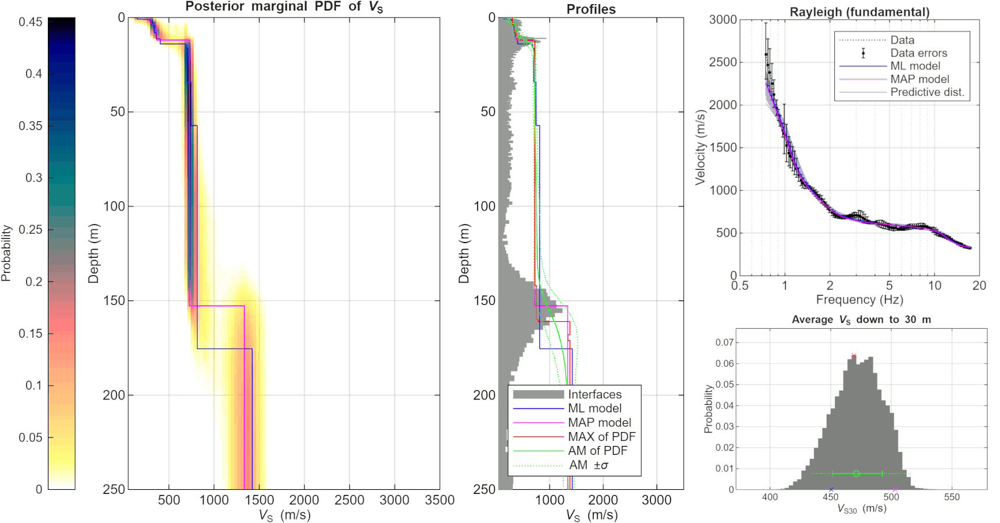

# HPC-parallelized Bayesian Inversion for Near-surface Imaging (NEOPSY)

Multizonal Transdimensional Inversion (MTI) to infer near-surface 1D layered velocity models.

<a href="#cite"></a>
[](https://doi.org/10.1093/gji/ggab116)


-%23002F5A?style=flat)


---

A unique software package NEOPSY for Multizonal Transdimensional Inversion (MTI) of near-surface 1D layered velocity models within a full Bayesian framework (Hallo et al., 2021). The framework is designed as transdimensional and data-driven, meaning the model complexity is inferred directly from the data. This is implemented by a mathematical **Occam's razor** inherent to the Bayesian formulation. The transdimensional model space is sampled using **Markov Chain Monte Carlo** (MCMC) with **Parallel Tempering**, enabling efficient exploration of high-dimensional and non-linear parameter spaces. The code is parallelized in **Fortran** using **MPI** (CPU), specifically optimized for deployment on **High-Performance Computing** (HPC) clusters and large-scale seismic inversions. This code was used for the inversion of near-surface structure on **Mars**, published in **Nature Communications** (Hobiger, Hallo, Schmelzbach et al., 2021).

## 1 METHODOLOGY

The suite uses the theory by Hallo et al. (2021).

Hallo, M., Imperatori, W., Panzera, F., Fäh, D. (2021). Joint multizonal
transdimensional Bayesian inversion of surface wave dispersion and
ellipticity curves for local near-surface imaging, Geophysical Journal
International, 226 (1), 627-659. [https://doi.org/10.1093/gji/ggab116](https://doi.org/10.1093/gji/ggab116)

## 2 TECHNICAL IMPLEMENTATION

Bayesian Inference, Markov Chain Monte Carlo (MCMC), Uncertainty Quantification,
High-Performance Computing (HPC), Code Parallelization by MPI (CPU), Transdimensional Bayesian Inference, 
Data-driven Inversion, Occam's razor

## 3 RELEASE HISTORY (MAJOR VERSIONS)

*   **4.0 (Fjord) — Public Release** | March 2026
    *   Public open-source release
    *   Integration with Geopsy 3.X
    *   New Outputs: Output ASCII files with layer interfaces, MAP model uncertainty, amplification, and V<sub>S30</sub>
    *   Advanced Visualization: Improved all plotting scripts, high-resolution resultant figures
    *   Localization: Added option for user-specific reference rock velocity model (for amplification); Japanese and Swiss reference models present in default

*   **3.0 (Eagle) — Geopsy Update** | April 2021
    *   Internal-only version
    *   Integration with Geopsy 3.X
    *   Geopsy Update: Forward problem routines changed to Geopsy 3.X
    *   Enhanced Engine: Support for irregular sampling of observed data in the frequency domain, improved speed by using binary data transfer between MCMC and Geopsy cores
    *   Key Publications: Eagle version used in publications by Glueer et al. (2024, [https://doi.org/10.3390/geosciences14020028](https://doi.org/10.3390/geosciences14020028)), van Ginkel et al. (2025, [https://doi.org/10.5194/tc-19-1469-2025](https://doi.org/10.5194/tc-19-1469-2025))

*   **2.0 (Desert) — Numerical Engine Revision** | May 2020
    *   Internal-only version
    *   Integration with Geopsy 2.X
    *   Enhanced Engine: Improved search for layers with inverse velocity, improved birth from prior
    *   Advanced Visualization: QWL impedance statistic, SH-wave transfer function statistic, high-resolution V<sub>S30</sub>
    *   Key Publications: Desert version (Desert2 patch) used in publications by Hallo et al. (2021, [https://doi.org/10.1093/gji/ggab116](https://doi.org/10.1093/gji/ggab116)), Hobiger, Hallo, Schmelzbach et al. (2021, [https://doi.org/10.1038/s41467-021-26957-7](https://doi.org/10.1038/s41467-021-26957-7))

*   **1.0 (Crimson/Coral) — Initial Release** | February 2020
    *   Internal-only version
    *   Integration with Geopsy 2.X
    *   Crimson version for Rayleigh waves (onshore), and Coral version for Scholte waves (offshore/lake)
    *   Key Publication: Coral version (Coral2 patch) used in publication by Shynkarenko et al. (2021, [https://doi.org/10.1093/gji/ggab314](https://doi.org/10.1093/gji/ggab314))

## 4 REQUIREMENTS

1. LINUX/UNIX machine with installed `timeout` program

2. Fortran90 (`gfortran` or `ifort`) and MPI (`mpif90` or `mpiifort`) compilers

3. Compiled Parallel Tempering library `pt.f90`
    * Parallel Tempering (PT) library (M.Sambridge)
    * [http://www.iearth.edu.au/codes/ParallelTempering/](http://www.iearth.edu.au/codes/ParallelTempering/)

4. Installed `Geopsy`
    * Open source software for geophysical research and applications (M.Wathelet)
    * Version 3.X is required
    * Neopsy makes use of the `gpdc` and `gpell` functions (in command line)
    * [https://www.geopsy.org/](https://www.geopsy.org/)

5. MATLAB R2025b or newer for plotting results (Python plotting is in preparation)

## 5 PACKAGE CONTENT

1. `data` - Directory containing observed data (dispersion and ellipticity SPAC curves) and reference rock velocity models `vs_ref_Swiss.ascii` and `vs_ref_Japan.ascii`
2. `inv` - Work directory for the ongoing inversion
3. `lib` - Directory with MATLAB function library
4. `src` - Directory with Fortran source codes of the NEOPSY (includes `Makefile`)
5. `data.para` - Settings of input data
6. `input.para` - Settings of the inversion
7. `run_timpi.sh` - Run the MTI inversion (step 1)
8. `run_tires.sh` - Run post-processing of the MTI inversion (step 2)
9. `plot_pop.m` - Plot resultant figures by MATLAB (step 3)

## 6 COMPILATION

1. Compile Parallel Tempering (PT) library in the `./src/pt` folder
2. Set your compilers in `Makefile` in the `./src` folder and type:
```bash
make
```
3. Check `npdc`, `tiser`, `timpi`, and `tires` binary programs in the project root directory
4. If necessary, make binaries executable by
```bash
chmod +x npdc tiser timpi tires
```

## 7 USAGE

1. Create a work directory `./inv` and log directory `./inv/log`. The name of the working folder is optional, but it has to be the same as defined in the `input.para` file (`run_timpi.sh` creates these directories automatically)
2. Prepare data files with observed dispersion and ellipticity curves in directory `./data`
3. Set input parameters of data and inversion (`data.para` and `input.para`) in NEOPSY root directory
4. **Step 1** - Run NEOPSY (executable `timpi` or `tiser`). You can do it manually, but it is strongly recommended to use the prepared bash file `run_timpi.sh`
```bash
bash ./run_timpi.sh
```
5. The result of NEOPSY is an ensemble of possible velocity models drawn from the transdimensional posterior probability density function. You can wait for the termination of MCMC Markov chains (it can last several hours) or kill `timpi` at any time (`kill -9 PID`). NEOPSY saves models continuously, so there is no harm if you kill it prematurely; there will be fewer models in the ensemble (but be careful to wait until the end of the burn-in phase). These models are saved in `./inv` directory in binary files (`xmodels*.dat`). You can check the state of the inversion at any time by browsing log files in `./inv/log`. Especially, note number of preformed steps and the best data variance reduction in files `stats_*.log`.
```text
  MCstep - Number of performed Markov steps
  AccT1 - New accepted sampling models
  AccAll - New accepted models (20 chains)
  Err - Number of cases when Geopsy failed
  aVR[%] - Highest data Variance Reduction
------------------------------------------
  MCstep   AccT1  AccAll     Err    aVR[%]
max_val:     100    2000    2000      100%
------------------------------------------
     100       0    1191       0  -2177.08
     200       0    1215       0    -80.91
     300       0    1154       0     14.60
     400      38    1093      11     46.63
     500      81    1037       1     65.67
	 ...
```
6. **Step 2** - Run the after-process (`tires`) to create PDFs, population histograms, QWL representation, SH-wave amplification, etc. You can run it manually, or by using the bash file `run_tires.sh` (recommended). The results are saved in `./inv` directory as (`out*` and `in*` files)
```bash
bash ./run_tires.sh
```
7. **Step 3** - Copy results (all `./inv/out*` and `./inv/in*` files) on device with a graphical interface and installed MATLAB (or open MATLAB with a graphical interface on the server). Then, run the MATLAB script `plot_pop.m` for plotting results (Python plotting is in preparation for the next NEOPSY version)

**Note:** See connected example files for `data.para`, `input.para`, and observed dispersion curves in `./data`. Also, see an example of the resulting posterior marginal probability density function of S-wave velocity, depth of layer interfaces, and V<sub>S30</sub> below.

<picture>
  <source media="(prefers-color-scheme: dark)" srcset="img/neopsy_dark.png">
  <source media="(prefers-color-scheme: light)" srcset="img/neopsy_light.png">
  
</picture>

## 8 COPYRIGHT

Copyright (C) 2019-2021 ETH Zurich (Architect: Miroslav Hallo)

This program is published under the GNU General Public License (GNU GPL).

This program is free software: you can modify it and/or redistribute it
or any derivative version under the terms of the GNU General Public
License as published by the Free Software Foundation, either version 3
of the License, or (at your option) any later version.

This code is distributed in the hope that it will be useful, but WITHOUT
ANY WARRANTY. We would like to kindly ask you to acknowledge the authors
and don't remove their names from the code.

You should have received a copy of the GNU General Public License along
with this program. If not, see <http://www.gnu.org/licenses/>.

<a name="cite"></a>
## 9 CITE AS

If you use NEOPSY, please cite both the original methodology paper (preferred) and the software version as follows:

### For the methodology and implementation:
> Hallo, M., Imperatori, W., Panzera, F., Fäh, D. (2021). Joint multizonal transdimensional Bayesian inversion of surface wave dispersion and ellipticity curves for local near-surface imaging. Geophysical Journal International, 226 (1), 627-659. [https://doi.org/10.1093/gji/ggab116](https://doi.org/10.1093/gji/ggab116)

---

## 10 USER MANUAL

### OBSERVED DATA

All files with observed data should be in the `./data` directory. However, you can use different
names and paths for data files, but you must specify them in the `data.para` file. All these files
must be in ASCII (UNIX standard - LF) and with line-fixed structure (i.e., do not add or remove
any line from these files and do not change the structure). The code reads these files line by line,
and it expects a particular structure. In the `data.para` file, lines starting with `#` are comments,
and the following text may be changed by the user without any effect on functionality. But it is
strictly prohibited to add or remove any additional commentary lines.

The `data.para` input file consists of 32 lines. There are YES/NO switches on lines 5, 8, and 11,
which let the user decide which modes of Rayleigh and Love dispersion curves, and ellipticity
curves will be used in the inversion. There are filenames (with path) below, where the code expects
the particular data (lines 14-26). If you select 0 (i.e., NO) for a mode, the respective filename
doesn't matter. You can use both the absolute or relative paths.

The data files (e.g., `Data_R0.dat`) consist of three columns. The first is frequency. The frequency
range and the sampling rate may be irregular, and they may differ among the modes used. But it
is recommended to use continuous regular sampling on a log-scale. At least, the frequency samples
should be in increasing order. The second column are measured data (slowness [s/m]; ellipticity
[0, Inf]; or ellipticity angle [deg]). The third column contains the expected uncertainty (error)
as 1sigma (or multiplication factor in the case of ellipticity). NEOPSY is Bayesian inversion, where
the measured data are weighted by the inverse of their uncertainties, so the uncertainty matters! If
you wish to decrease the weight of any data, increase the uncertainty. If you wish to ignore some
of your data samples in the inversion, give them an arbitrary negative uncertainty (e.g., -1). Note
that the first line of the data files is always a comment, and there is only one data file allowed per
wave mode. I would like to emphasize that the uncertainty, as the inversion input, should contain
a sum of uncertainty of observed data (results from field measurements) and theory (we fit data
with a 1D layered model, but nature is more complex).

### SETTINGS OF INVERSION

The settings of the NEOPSY are managed by the `input.para` ASCII file (UNIX standard - LF).
This file has a line-fixed structure similarly as `data.para` file. However, the number of lines in
this file may vary based on the number of zones or the number of fixed Voronoi nuclei. Add and
remove lines very carefully. The minimum number of lines of `input.para` file is 54 (see figure below), 
while there are more lines in the multizonal case. An extension by one zone (i.e., increasing the 
number on the fixed-line 8) results in additional lines for S-wave, P-wave, density, and Poisson’s ratio 
limits, and Vs/Vp/rho MCMC steps (i.e., 5 additional lines for each additional zone). The number of 
fixed Voronoi nuclei then simply say to the code how many lines it should read at the end of this file. 
The meaning of all parameters is emphasized in the comments of this input file.

### RUN INVERSION

**Step 1** - NEOPSY can be executed on multiple nodes (program `timpi`) or a single node (program `tiser`).
Both programs must have two input command-line arguments: (1) path to `input.para` file; (2) path
to `data.para` file. The path may be either absolute or relative. The single-node version is meant
for testing purposes or low-end PCs. Each deployed node makes use of one CPU and same amount
of RAM (e.g., 16 nodes = 16 deployed CPUs and 16x the required RAM amount). To run the `timpi`,
you have to use `mpirun` command. For your convenience, it is strongly recommended to use the
pre-prepared bash script `run_timpi.sh` to run the inversion. This bash script gets the name 
of the working folder; copy `input.para` and `data.para` files into the working folder; execute 
the inversion with the proper arguments in the background; and save PID of the executed 
inversion to `yymmdd_HHMMSS.pid` file. The result of the NEOPSY is an ensemble of possible models drawn 
from the transdimensional posterior probability density function on model parameters. So, you can 
wait for the termination of MCMC Markov chains (it can last several hours) or kill the process at any time (`kill -9 PID`). 
NEOPSY saves models continuously, so there is no harm if you kill it prematurely; there will be fewer 
models in the ensemble (but be careful to wait until the end of the burn-in phase). These models 
are saved in `./inv` directory in binary files (`xmodels*.dat`). You can check the state of the inversion
at any time by browsing log files in `./inv/log`. Especially, note number of preformed steps and the best
data variance reduction in files `stats_*.log`.

**Step 2** - When the inversion is done (finished or killed), you must run the after-process (program
`tires`) to create ASCII files with results. The main purpose of this after-processing is to create
histograms, probability density functions, compute quarter-wavelength representation, V<sub>S30</sub>, SH-wave
transfer function, etc. As with `timpi`, you can run it manually or by using the bash file
`run_tires.sh`. It requires only one node (one CPU). So, it is not as demanding as `timpi`. Be sure
you run it with `input.para` and `data.para` files which are identical to those in Step 1. Results (ASCII
files) are saved in `./inv` directory as `out*` and `in*` files.

**Step 3** - To plot the results, all you need are the files from the previous step and MATLAB with
a graphical interface (Python plotting is in preparation for the next NEOPSY version). The size of these
resultant ASCII files is quite small, so you can copy all of them to your local computer with MATLAB software
installed. The plotting procedure is easy. You just run the `plot_pop.m` script with the presence of `./lib`
and `./inv` folders, and figures will pop up automatically. If you use a different working folder or want to
control the behavior of the output figures, you can change some parameters at the beginning of the `plot_pop.m` script.

### ERROR LIST

The NEOPSY software can produce various error/warning messages to inform the user about the source
of some problems/irregularities. The purpose of the internal error handling is to allow users to
find issues in the input and/or to trace the source of potential problems. Most of the errors are
input-related and can be easily solved by the user. Moreover, the program may produce some
warnings of information characters (excluded from this list as they are informational only).

* **ERROR 101** – This occurs if the user calls an executable binary file (timpi, tiser, tires) without
            two command-line arguments. The first argument `(path/)filename` is the (path
            and) filename of the input.para file. The second argument `(path/)filename` is
            the (path and) filename of the data.para file. Solution: Include both in your command-
            line expression, calling these binary files.
* **ERROR 102** – This occurs if the input.para file given in the first command-line argument does
            not exist. Solution: Include a correct filename and path to this file (the path is not
            mandatory if it is in the same directory as the executable file).
* **ERROR 103** – This occurs if the data.para file given in the second command-line argument does
            not exist. Solution: Include a correct filename and path to this file (the path is not
            mandatory if it is in the same directory as the executable file).
* **ERROR 104** – This occurs if the number of dept-zones in input.para is not a positive integer.
            Solution: Include a correct number of dept-zones in the input.para file (e.g., 1).
* **AUTOC 105** – This occurs if the program performs an autocorrection of the user input to fulfill
            requirements: The total maximal number of the Voronoi nuclei from input.para must
            be greater than the number of depth-zones. Solution: Just bear it in mind or increase
            the maximum number of the Voronoi nuclei in the input.para.
* **AUTOC 106** – This occurs if the program performs an autocorrection of the user input to fulfill
            requirements: The minimum layer-interface depth must be positive and non-zero
            (because a logarithm of depth is used). Solution: Just bear it in mind or include a
            valid minimum layer interface depth in the input.para.
* **ERROR 107** – This occurs if the profile’s maximum depth is smaller than the minimum depth in
            the input.para. Solution: Include correct depths in the input.para file (e.g., 0.5
            250.0).
* **AUTOC 108** – This occurs if the program performs an autocorrection of the user input to fulfill
            requirements: The transdimensional proposal probability. Solution: Just bear it in
            mind or include a number < 0.45 in the input.para.
* **AUTOC 109** – This occurs if the program performs an autocorrection of the user input to fulfill
            requirements: The number of Voronoi nuclei in the non-transdimensional inversion.
            Solution: Just bear it in mind or increase the total maximal number of the Voronoi
            nuclei in the input.para.
* **ERROR 110** – This occurs if the Gaussian random walker step size in the input.para is too large
            for this profile. Solution: Decrease the log-depth step size in the input.para file.
* **ERROR 111** – This occurs if a zone is defined below the max depth of the profile. Solution: Increase
            the maximal depth of the profile in the input.para file or delete the deepest depthzone.
* **SWAP 112** – This occurs if the program performs an autocorrection of the user input to fulfill
           requirements: The first argument of S-wave velocity thresholds must be smaller
           than the second one. The program performed an automatic swap of these two values.
           Solution: Just bear it in mind or swap them manually in the input.para.
* **SWAP 113** – This occurs if the program performs an autocorrection of the user input to fulfill
           requirements: The first argument of P-wave velocity thresholds must be smaller
           than the second one. The program performed an automatic swap of these two values.
           Solution: Just bear it in mind or swap them manually in the input.para.
* **SWAP 114** – This occurs if the program performs an autocorrection of the user input to fulfill
           requirements: The first argument of density thresholds must be smaller than the
           second one. The program performed an automatic swap of these two values. Solution:
           Just bear it in mind or swap them manually in the input.para.
* **SWAP 115** – This occurs if the program performs an autocorrection of the user input to fulfill
           requirements: The first argument of Poisson ratio thresholds must be smaller than
           the second one. The program performed an automatic swap of these two values.
           Solution: Just bear it in mind or swap them manually in the input.para.
* **ERROR 116** – This occurs if the Gaussian random walker S-wave velocity step size in the input.para
            is zero or less. Solution: Set the S-wave velocity step size to a positive non-zero
            value in the input.para file.
* **ERROR 117** – This occurs if the Gaussian random walker P-wave velocity step size in the input.para
            is zero or less. Solution: Set the P-wave velocity step size to a positive non-zero
            value in the input.para file.
* **ERROR 118** – This occurs if the Gaussian random walker density step size in input.para is zero or
            less. Solution: Set the density step size to a positive non-zero value in the
            input.para file.
* **AUTOC 119** – This occurs if the program performs an autocorrection of the user input to fulfill
            requirements: The Gaussian random walker S-wave velocity step size in the input.para
            was too large and has been decreased. Solution: Just bear it in mind or
            decrease it manually in the input.para.
* **AUTOC 120** – This occurs if the program performs an autocorrection of the user input to fulfill
            requirements: The Gaussian random walker P-wave velocity step size in the input.para
            was too large and has been decreased. Solution: Just bear it in mind or
            decrease it manually in the input.para.
* **AUTOC 121** – This occurs if the program performs an autocorrection of the user input to fulfill
            requirements: The Gaussian random walker density step size in the input.para was
            too large and has been decreased. Solution: Just bear it in mind or decrease it
            manually in the input.para.
* **ERROR 122** – This occurs if the depth difference between two arbitrary fixed Voronoi nuclei is
            smaller than a limit (0.1[m] in default). Solution: Increase the depth span between
            the fixed Voronoi nuclei in the input.para file.
* **ERROR 123** – This occurs if the working directory does not exist (./inv/ in default). Solution: create
            the working directory (with name and path asset in the input.para file).
* **ERROR 124** – This occurs if the logging directory does not exist (./inv/log in default). Solution:
            create the logging directory (a subdirectory named “log” in the working directory).
* **AUTOC 125** – This occurs if the program performs an autocorrection of the user input to fulfill
            requirements: The transdimensional proposal probability must be equal to 0.0 in
            the case of non-transdimensional inversion. Solution: Just bear it in mind or set the
            transdimensional proposal probability to 0.0 in the input.para.
* **AUTOC 126** – This occurs if the program performs an autocorrection of the user input to fulfill
            requirements: The transdimensional proposal probability must be equal to 0.0 in
            the case of non-transdimensional inversion. Solution: Just bear it in mind or set the
            transdimensional proposal probability to 0.0 in the input.para.
* **ERROR 127** – This occurs if the settings in the input.para suggests a non-transdimensional inversion
            (transdimensional proposal probability is equal to 0.0), but the number of fixed
            Voronoi nuclei (or the fixed number of layers) is set to zero. Solution: set the transdimensional
            proposal probability OR the number of required fixed nuclei to a positive number.
* **ERROR 128** – This occurs if the settings in the input.para suggests a non-transdimensional inversion
            (transdimensional proposal probability is equal to 0.0), but there is more than
            one depth zone defined. The depth zones are a feature of the transdimensional
            inversion, and it is impossible to mix them with a fixed number of Voronoi nuclei
            (or layers). Solution: delete all the superfluous depth zones.
* **ERROR 129** – This occurs if the settings in the input.para suggests using user-defined initial model
            (expert mode settings) together with a multizonal inversion. Solution: turn off the
            respective expert switch OR delete all depth zones.
* **ERROR 130** – This occurs if the settings in the input.para suggests using user-defined initial model
            (expert mode settings) together with a non-transdimensional inversion. Solution:
            turn off the respective expert switch OR select to use single-zonal transdimensional
            inversion.
* **WARNING 201** – This occurs if no mode of Rayleigh or Love wave dispersion curves in the
              data.para. Solution: turn on at least one switch for the surface wave dispersion
              modes (set at least one to 1).
* **ERROR 202** – This occurs if there is a switch on for both ellipticity and ellipticity angle. Solution:
            turn one of these two switches to zero in the data.para.
* **ERROR 203-206** – This occurs if a Rayleigh wave data file is given in the data.para does not exist
                (R0, R1, R2, R3). Solution: Include a correct filename and path to this file (the path
                is not mandatory if it is in the same directory as the executable file).
* **ERROR 207-210** – This occurs if a Love wave data file is given in the data.para does not exist (L0,
                L1, L2, L3). Solution: Include a correct filename and path to this file (the path is
                not mandatory if it is in the same directory as the executable file).
* **ERROR 211-212** – Occurs if the ellipticity (or ellipticity angle) data file is given in the data.para
                does not exist. Solution: Include a correct filename and path to this file (the path is
                not mandatory if it is in the same directory as the executable file).
* **ERROR 213** – Occurs if the file with the initial model (expert mode settings), which is given in the
            data.para, does not exist. Solution: Include a correct filename and path to this file
            OR turn off the respective expert switch.
* **ERROR 214** – This occurs if the initial model (expert mode settings) given in the data.para has a
            corrupted or unknown structure. Solution: Include the initial model file with the
            correct structure OR turn off the respective expert switch.
* **ERROR 215** – Occurs if the file with the reference velocity model does not exist. Solution: 
            Include a correct filename and path to this file.
* **ERROR 301** – This occurs if the generation of initial random models takes too many interactions.
            It means that the model space is too large and over-conditioned. Solution: Reduce
            the number of higher modes of observed data; increase the uncertainty of the observed
            data; decrease the span of search for S, P-wave velocity, density, and
            Poisson ratio; and/or check if observed data are OK.
* **ERROR 302** – This occurs when performing a non-transdimensional inversion (transdimensional
            proposal probability is equal to 0.0), but the number of fixed Voronoi nuclei (or
            the fixed number of layers) is set to zero. Solution: set the transdimensional proposal
            probability OR the number of required fixed nuclei to a positive number.
* **ERROR 303** – This occurs if the number of required layers in a non-transdimensional inversion
            exceeds the maximum number of allowed Voronoi nuclei. Solution: Increase the
            maximum number of allowed Voronoi nuclei in the input.para file and run again.
* **ERROR 304-309** – Occurs if a problem occurred during reading and processing of the user-defined
                initial model (expert mode settings) given in the data.para. For details, see
                the message coming with the error code. Solution: Include the initial model file
                with the correct structure, OR turn off the respective expert switch.
* **ERROR 401** – This occurs if there is an error in the forward problem during the after-processing
            of the saved models. There should be none as the saved models have been processed
            in the main run already. Solution: Check, if you are after-processing results
            from the correct main run (check the changed date of xmodels*.dat files and
            check if they are non-empty); check if you are using the same settings in
            input.para and data.para in the after-process as in the main run; if nothing helps,
            clean working directory and run the inversion carefully again.
			